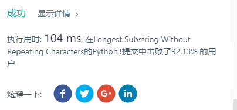

### LeetCode3 Longest Substring Without Repeating Characters

Given a string, find the length of the longest substring without repeating characters.

Examples:

Given "abcabcbb", the answer is "abc", which the length is 3.

Given "bbbbb", the answer is "b", with the length of 1.

Given "pwwkew", the answer is "wke", with the length of 3. Note that the answer must be a substring, "pwke" is a subsequence and not a substring.  

**思路一：**  
暴力点，将字符串s去重后，得到s中出现的字符总数，即为最大无重复字符的子串长度，然后遍历搜索。
```Python
class Solution(object):
    def lengthOfLongestSubstring(self, s):
        """
        :type s: str
        :rtype: int
        """
        temp = len(set(s))
        if temp == 0: return 0
        res = None
        while temp > 0:
            for i in range(len(s)-temp+1):
                res = s[i:i+temp]
                if len(set(res)) == len(res):
                    return len(res)
            temp -= 1
```
**结果：**  暴力虽能解决问题，但是用时太长，击败19%用户。有待改进。  

**思路二：**  
使用hash_table存放子串及每个字符的index，start指向子串开始的index，当下一个字符与hash_table重复且start小于等于重复字符的index时，slide start → 重复字符的下一个位置。  
```Python
class Solution(object):
    def lengthOfLongestSubstring(self, s):
        """
        :type s: str
        :rtype: int
        """
        start = length = 0
        substring = {}
        for i,st in enumerate(s):
            if (st in substring) and (start <= substring[st]):
                start = substring[st] + 1
            else:
                length = max(length, i-start+1)
            substring[st] = i
        return length
```
**分析：**  
类似于[第一题](https://github.com/DaisyLoveU/Python-learning/blob/master/LeetCode/LeetCode1-Two%20Sum.md)的思想。  
时间复杂度$O(n)$,空间复杂度$O(set(s))$  
**结果：**  

